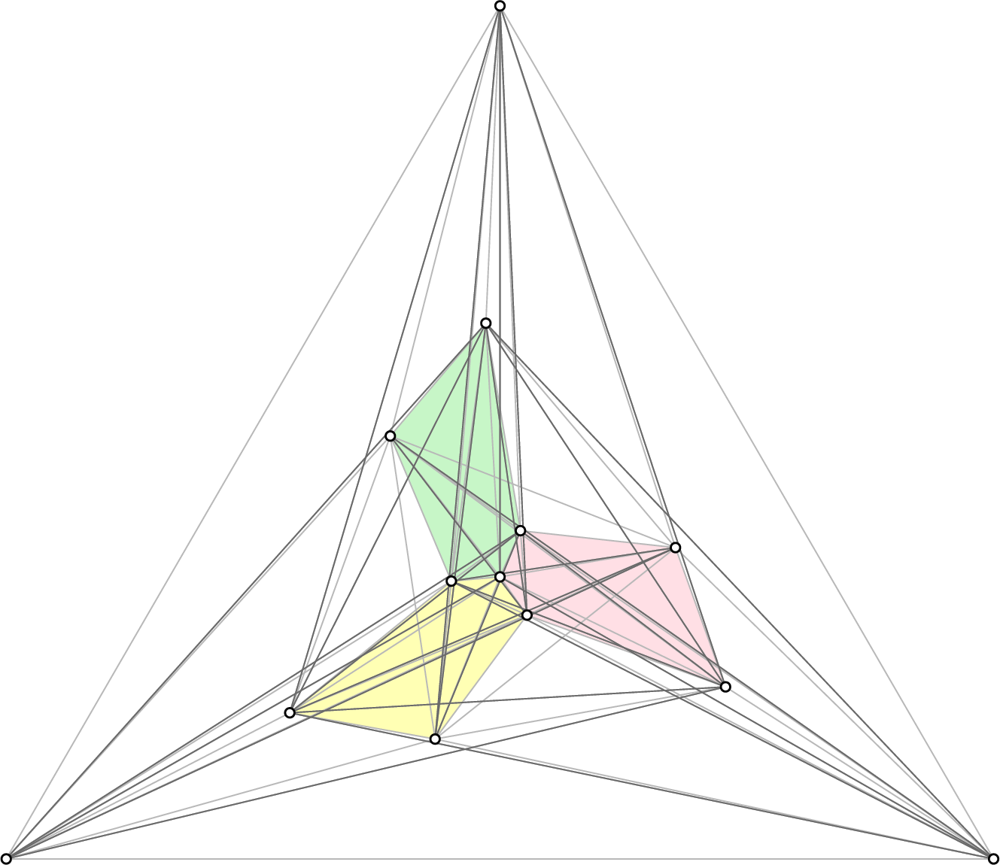

 
# A superlinear lower bound on the number of 5-holes

This website provides a program to verify the computer-assisted lemmas from our paper "A superlinear lower bound on the number of 5-holes", which is by Oswin Aichholzer, Martin Balko, Thomas Hackl, Jan Kynčl, Irene Parada, Manfred Scheucher, Pavel Valtr, and Birgit Vogtenhuber.

[](http://www.eurogiga-compose.eu/posezo/n13_c1_min_convex_3_4_5_holes/n13_c1_min_convex_3_4_5_holes.php)

## Abstract of the paper

Let $P$ be a finite set of points in the plane in _general position_, that is, no three points of $P$ are on a common line. We say that a set $H$ of five points from $P$ is a _$5$-hole in $P$_ if $H$ is the vertex set of a convex $5$-gon containing no other points of $P$. For a positive integer $n$, let $h_5(n)$ be the minimum number of 5-holes among all sets of $n$ points in the plane in general position.  
Despite many efforts in the last 30 years, the best known asymptotic lower and upper bounds for $h_5(n)$ have been of order $\Omega(n)$ and $O(n^2)$, respectively. We show that $h_5(n) = \Omega(n\log^{4/5}{n})$, obtaining the first superlinear lower bound for $h_5(n)$.  
The following structural result, which might be of independent interest, is a crucial step in the proof of this lower bound. If a finite set $P$ of points in the plane in general position is partitioned by a line $\ell$ into two subsets, each of size at least five and not in convex position, then $\ell$ intersects the convex hull of some 5-hole in $P$. The proof of this result is computer-assisted.

## Short description of the program

This program uses functions from the python order type library "pyotlib", which was initiated during my (second) Bachelor's thesis in Technical Mathematics. The idea of providing such a library already came up during my first Bachelor's thesis in Computer Science, where several functionalities were implemented to work with order types of point sets in the plane. For the sake of shortness, only relevant code parts were copied from pyotlib - all additional functionality was removed.

As mentioned in the paper, there is a second independent implementation available to verify the lemmas. The second program was written by Martin Balko and is available on [Martin Balko's homepage](http://kam.mff.cuni.cz/~balko/superlinear5Holes).

## The order type database

The statements of Computer lemma 1 - 4 (Lemma 12 - 15 in SoCG Version) can be verified by testing all possible order types of $n \le 11$ points in the plane in general position. The order type database for up to 11 points was generated by Aichholzer, Aurenhammer, and Krasser and the complete database of all realizable order types for up to ten points is available online on [Oswin Aichholzer's homepage](http://www.ist.tugraz.at/aichholzer/research/rp/triangulations/ordertypes/). Since the complete database of all realizable order types with eleven points needs about 96 GB, it is available upon request.

### Filtering the database

Instead of testing the complete database on eleven points (96 GB), one can take a closer look on our lemmas. Also the following observations give a bit more insight into the actual structure of $\ell$-divided sets, which do not have $\ell$-divided 5-holes.

Each of our lemmas considers $P$ to be an $\ell$-divided sets $P = A \cup B$ with no $\ell$-divided 5-hole in $P$ and, if $|P|=11$, $|A|=5$ and $|B|=6$ (or the vice versa). Since 5-holes either lie completely in $A$ or in $B$, one only needs to consider order types of eleven points with either no 6-hole or one 6-hole. Moreover, since six points in general position either have zero, one, two, or six 5-holes, and since $h_5(11)=2$, there are either 1+1, 0+2, 1+2, 0+6, or 1+6 5-holes in total. Altogether, a set $P$ of eleven points fulfilling the requirements of the lemmas is one of the following four types:

*   (a) no 6-hole and two 5-holes.
*   (b) no 6-hole and three 5-holes.
*   (c) one 6-hole and six 5-holes.
*   (d) one 6-hole and seven 5-holes.

We pre-filtered the complete database of order types with eleven points for those four types. Since we actually do not distinguish between those four types when verifing the lemmas with our program, we provide a file which contains all order types of those four types (22.8 MB) \[[download](files/otypes11_filtered.b16)\].

Similarly, instead of testing the complete database on ten points (546 MB), one can restrict $P$ with $|P|=10$ to the following three types:

*   (a) no 6-hole and one 5-hole.
*   (b) no 6-hole and two 5-holes.
*   (c) one 6-hole and six 5-holes.

Reasoning: For $P=A \cup B$ with $|A|=5=|B|$, there is at most one 5-hole in each of $A$ and $B$, and due to Harborth's result, there is at least one 5-hole in $P$. For $P=A \cup B$ with $|A|=6$ and $|B|=4$, $B$ does not contain 5-holes and $A$ (and thus $P$) contains either one 5-hole, two 5-holes, or a 6-hole.  
We also pre-filtered the complete database of order types with ten points for those four types. Since we actually do not distinguish between those three types when verifing the lemmas with our program, we provide a file which contains all order types of those three types (2.3 MB) \[[download](files/otypes10_filtered.b16)\].

Similar arguments apply for $|P|=9$, where $P$ has either

*   (a) no 5-hole or
*   (b) one 5-hole.

We provide a file which contains all order types of those two types (120 KB) \[[download](files/otypes09_filtered.b16)\].

## Program description

The program iterates over every order type from the given input-file, given by a 8- or 16-bit encoded point-set realization (see [Oswin Aichholzer's homepage](http://www.ist.tugraz.at/aichholzer/research/rp/triangulations/ordertypes/) for more information), and tests whether the desired statements -- given as command line parameters -- hold. The program tests all possible dividing lines $\ell$, which partition the given point set $P$ into two sets $A$ and $B$ with the desired properties (size, convexity, number of extremal points of $P$). Depending on the parameters of the program, one can test

*   whether there are $\ell$-divided 5-holes in $P$,
*   whether the nonconvex $a$-wedge (if any) is empty of points of $B$, and
*   whether a convex $a$-wedge contains 3 points of $B$.

## Program usage

The program can be run with [Python 2.7.x](https://www.python.org/). No additional libraries are required. To decode a given input file, the program requires the number of points ("n"), the number of bytes ("bytes"), and the filepath ("fp") as command line parameters. The parameter "sizeA" specifies the number of points in $A$. The parameter "convA" specifies whether A can be arbitrary (value 0), whether A must be convex (value +1), or whether A must be nonconvex (value -1). The parameter "testwedges" specifies whether only divided 5-holes should be tested (value 0) or whether also convex a-wedges should be tested to contain at most two points of $B$. The parameter "nonconvexwedgeempty" specifies whether the non-convex a-wedge can contain points (value 0) or whether the non-convex a-wedge must be empty of points from $B$ (value 1).

The following shows the commands (including all parameters) to verify the lemmas.

### Computer lemma 1

#### Statement

Let $P = A\cup B$ be an $\ell$-divided set with $|A|=5$, $|B|=6$, and with $A$ not in convex position. Then there is an $\ell$-divided 5-hole in $P$.

#### Command

To verify the statement, run

```python program.py n 11 bytes 2 fp otypes11_filtered.b16 sizeA 5 convA -1 testwedges 0```

Verification time: <2 hours.

### Computer lemma 2

#### Statement

Let $P = A\cup B$ be an $\ell$-divided set with no $\ell$-divided $5$-hole in $P$, $|A| = 5$, $4 \le |B| \le 6$, and with $A$ in convex position. Then, for every point $a$ of $A$, every convex $a$-wedge contains at most two points of $B$.

#### Command

To verify the statement for $|B|=4$ ($|P|=9$), run

```python program.py n 9 bytes 2 fp otypes09_filtered.b16 sizeA 5 convA +1 testwedges 1 nonconvexwedgeempty 0```

Verification time: <1 minute.

To verify the statement for $|B|=5$ ($|P|=10$), run

```python program.py n 10 bytes 2 fp otypes10_filtered.b16 sizeA 5 convA +1 testwedges 1 nonconvexwedgeempty 0```

Verification time: <10 minutes.

To verify the statement for $|B|=6$ ($|P|=11$), run

```python program.py n 11 bytes 2 fp otypes11_filtered.b16 sizeA 5 convA +1 testwedges 1 nonconvexwedgeempty 0```

Verification time: <2 hours.

### Computer lemma 3

#### Statement

Let $P = A\cup B$ be an $\ell$-divided set with no $\ell$-divided $5$-hole in $P$, $|A|=6$, and $|B|=5$. Then, for every point $a$ of $A$, every convex $a$-wedge contains at most two points of $B$.

#### Command

To verify the statement, run

```python program.py n 11 bytes 2 fp otypes11_filtered.b16 sizeA 6 convA 0 testwedges 1 nonconvexwedgeempty 0```

Verification time: <2 hours.

### Computer lemma 4

#### Statement

Let $P = A\cup B$ be an $\ell$-divided set with no $\ell$-divided $5$-hole in $P$, $5 \le |A| \le 6$, $|B| = 4$, and with $A$ in convex position. Then, for every point $a$ of $A$, if the non-convex $a$-wedge is empty of points of $B$, every $a$-wedge contains at most two points of $B$.

#### Command

To verify the statement for $|A|=5$ ($|P|=9$), run

```python program.py n 9 bytes 2 fp otypes09_filtered.b16 sizeA 5 convA +1 testwedges 1 nonconvexwedgeempty 1```

Verification time: <1 minute.

To verify the statement for $|A|=6$ ($|P|=10$), run

```python program.py n 10 bytes 2 fp otypes10_filtered.b16 sizeA 6 convA +1 testwedges 1 nonconvexwedgeempty 1```

Verification time: <30 minutes.

### Remark

The program can also be run on the order types of six points (without additional parameters) to verify that $h_5(P) \in \{0,1,2,6\}$ for every point set $P$ with $|P| = 6$. To verify the statement, run

```python program.py n 6 bytes 1 fp otypes06.b08```

Verification time: <1 second.

## Downloads

*   The source code of the program \[[download](files/program.py)\]
*   All order types of six points (<1 KB) \[[download](http://www.ist.tugraz.at/aichholzer/research/rp/triangulations/ordertypes/data/otypes06.b08)\]
*   All order types of nine points with one of the two relevant types (120 KB) \[[download](files/otypes09_filtered.b16)\]
*   All order types of ten points with one of the three relevant types (2.3 MB) \[[download](files/otypes10_filtered.b16)\]
*   All order types of eleven points with one of the four relevant types (22.8 MB) \[[download](files/otypes11_filtered.b16)\]